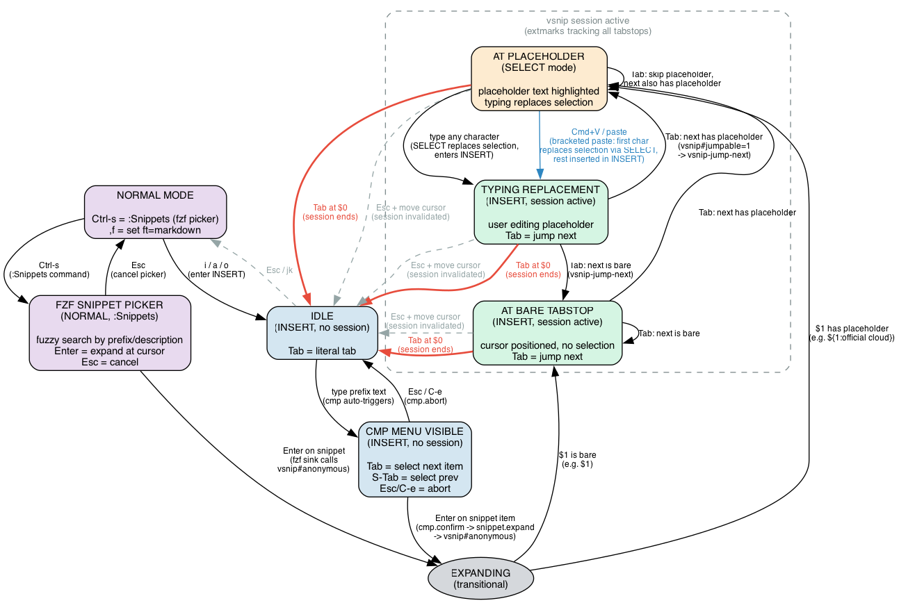

# snippets

prompt templates and reusable text fragments, powered by [vim-vsnip](https://github.com/hrsh7th/vim-vsnip) and integrated with nvim-cmp for autocomplete.

`-s ses_387ec1e53ffeGh0P9a6PgVa5R7` from `/Users/regular/knowledge/personal/repositories/faded-setup`

## files

- `global.json` - all snippet definitions (VSCode JSON format), loaded for every filetype
- `vsnip-cmp-state-flow.dot` - graphviz source for the state diagram below
- `vsnip-cmp-state-flow.svg` / `.png` - rendered state diagram

## usage

- **in INSERT mode**: type a snippet prefix (e.g. `compare`), select from cmp popup, Enter to expand, Tab/S-Tab to jump between placeholders
- **in NORMAL mode**: `Ctrl-s` opens an fzf picker listing all snippets with descriptions; selecting one expands it at the cursor
- **`:Snippets`** command does the same as `Ctrl-s`

## adding snippets

add entries to `global.json`:

```json
"short-name": {
    "prefix": "short-name",
    "description": "verbose description of when/why to use this, shown in cmp menu",
    "body": ["line 1", "${1:placeholder}", "line 3", "$0"]
}
```

the canonical inventory is also maintained in `~/knowledge/personal/PROMPTING.md` under `# snippets`.

## how it works

vim-vsnip, cmp-vsnip, and nvim-cmp are three independent plugins wired together by custom config in `lua/plugins.lua`. none of them are aware of each other natively; the Tab keybinding priority chain in the cmp mapping is the orchestration layer.

the state flow diagram below shows the full lifecycle from typing a prefix to expanding a snippet to tabbing through placeholders. the key insight is that vsnip maintains a buffer-local **session** (tracked via neovim extmarks) that makes `vsnip#jumpable()` return 1, which is what causes Tab to jump between tabstops instead of doing its normal cmp/fallback behavior. placeholders use vim's SELECT mode (not VISUAL) so typing any character replaces the selection.



to regenerate after editing the `.dot` source:

```sh
dot -Tsvg vsnip-cmp-state-flow.dot -o vsnip-cmp-state-flow.svg
dot -Tpng vsnip-cmp-state-flow.dot -o vsnip-cmp-state-flow.png
```
